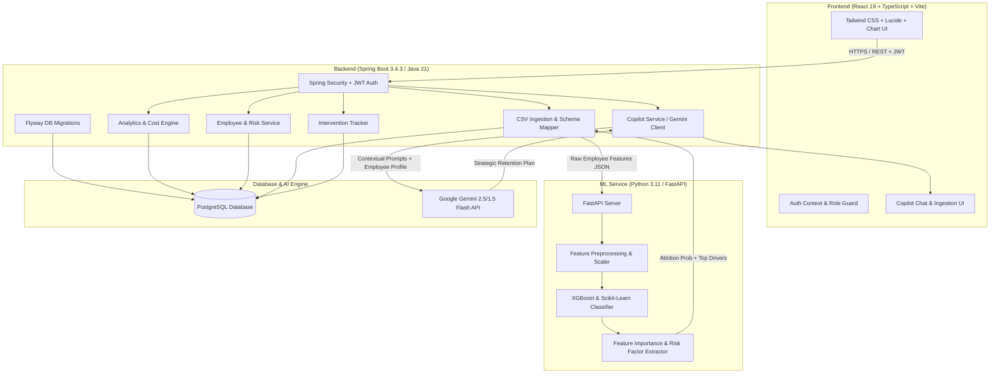

# RetainAI — Predictive Workforce Intelligence & Attrition Prevention Platform

<div align="center">


### **Predict · Prevent · Retain**
*Know who is at risk before they hand in notice.*

[](https://www.oracle.com/java/)
[](https://spring.io/projects/spring-boot)
[](https://react.dev/)
[](https://www.typescriptlang.org/)
[](https://fastapi.tiangolo.com/)
[](https://xgboost.readthedocs.io/)
[](https://ai.google.dev/)
[](https://www.postgresql.org/)

</div>

---

## 📌 Project Aim & Motivation

Unplanned employee turnover costs enterprises up to **1.5x to 2.0x an employee's annual salary** in lost productivity, institutional knowledge drain, and recruitment overhead. Traditional HR mechanisms (e.g., annual engagement surveys or exit interviews) are **post-mortem and reactive** — identifying issues only after the decision to quit has already been made.

**RetainAI** solves this by delivering an end-to-end **Predictive Workforce Intelligence & Retention System**:
1. **Early Risk Detection:** Machine Learning algorithms detect subtle attrition signals (overtime patterns, promotion stagnation, compensation gaps, engagement drift) months ahead of departure.
2. **Explainable AI (XAI):** Rather than outputting a black-box probability, RetainAI isolates the exact root-cause drivers (e.g., *“35% lower compensation than peer benchmark + 28 months without promotion”*).
3. **Financial Quantification:** Automatically computes live **Cost-at-Risk** across departments, enabling HR executives to justify retention budgets.
4. **Actionable AI Copilot:** Built-in Google Gemini agent formulates tailored retention strategies, personalized 1-on-1 talking points for managers, and compensation revision scenarios.

---

## 🏛️ System Architecture

RetainAI uses a decoupled **Microservices Architecture** designed for high throughput, modular ML pipelines, and enterprise-grade security:



---

## 🔄 End-to-End Architectural Flow

### 1. Data Ingestion & Schema Normalization
* HR Admins upload employee HRIS data (CSV format).
* RetainAI's backend schema mapper validates required indicators (`MonthlyIncome`, `OverTime`, `YearsSinceLastPromotion`, `JobSatisfaction`, `YearsAtCompany`, etc.).
* Invalid rows are flagged, and clean datasets are packaged for scoring.

### 2. Machine Learning Inference & Explainability
* The Spring Boot backend invokes the **FastAPI ML Service** via HTTP:
  * Categorical features are one-hot encoded and numerical features are normalized.
  * An ensemble **XGBoost / Gradient Boosting Classifier** calculates attrition probability (0.00 – 1.00).
  * Risk tiers are assigned:
    * 🔴 **High Risk:** $\ge 70\%$
    * 🟡 **Medium Risk:** $40\% - 69\%$
    * 🟢 **Low Risk:** $< 40\%$
  * Feature importance extracts the top 3 contributing factors for every employee.

### 3. Financial Cost-at-Risk Engine
* For each at-risk employee, the platform calculates turnover financial exposure:
  $$\text{Turnover Cost} = \text{Annual Salary} \times 1.5$$
* Aggregate financial risk is projected by department and team to prioritize interventions where ROI is highest.

### 4. Generative AI Copilot (Spring AI + Google Gemini)
* The HR Copilot inspects real-time employee metrics, team sentiment, and historical risk factors.
* Generates actionable suggestions:
  * Personalized 1-on-1 check-in questions for People Managers.
  * Salary adjustment recommendations against market median.
  * Career development and role rotation pathways.

### 5. Intervention Lifecycle Management
* Managers and HR can log specific interventions (`Compensation Adjustment`, `Role Change`, `Flexible Working Arrangement`, `Mentorship`).
* Tracks status from **Initiated** ➔ **In-Progress** ➔ **Resolved**, recording impact on post-intervention retention.

---

## 👥 Role-Based Access Control (RBAC)

RetainAI implements fine-grained enterprise roles:

| Feature | HR Admin (`HR_ADMIN`) | People Manager (`MANAGER`) |
| :--- | :---: | :---: |
| **Org-Wide Attrition Radar** | ✅ Full Access | ❌ Restricted |
| **Department / Team Hotspots** | ✅ All Departments | ✅ Own Team Only |
| **CSV Data Ingestion / Upload** | ✅ Yes | ❌ Read Only |
| **Employee Risk Drilldowns** | ✅ Company-wide | ✅ Direct Reports |
| **Cost-at-Risk Analytics** | ✅ Full Financials | ⚠️ Anonymized / Team |
| **AI Copilot** | ✅ Strategic HR Scope | ✅ Team Coaching Scope |
| **Intervention Logging** | ✅ Yes | ✅ Yes |

---

## 🏢 Enterprise Access & Provisioning Model (Internal B2B Tool)

> [!IMPORTANT]
> **No Public Self-Registration / Sign-Up:**  
> RetainAI is strictly an **internal B2B enterprise platform**. Because it processes sensitive workforce compensation, appraisal history, and retention flight-risks, **individual users or external visitors cannot publicly self-register or sign up**.

### How Access Works in an Organization:
1. **Enterprise Procurement:** An organization procures/purchases RetainAI enterprise workspace licenses.
2. **Tenant Provisioning:** The corporate workspace is deployed and linked with company security policies.
3. **Internal Account Provisioning:** The company's Executive HR Admin provisions People Manager seats and configures role-based access. Individual users receive access credentials directly from their organization's internal HR team.
4. **Zero Open Registrations:** Keeps company attrition data strictly confidential and accessible only to authorized HR and managerial personnel.

---

## 🔑 Demo Access Credentials (For Testing & Review)

Because public sign-up is disabled by design, the database includes **pre-seeded corporate test accounts** so recruiters, reviewers, and developers can test both administrative and managerial workflows:

| Role | Email | Password | Scope |
| :--- | :--- | :--- | :--- |
| **HR Admin** | `elena.vance@company.com` | `password123` | Executive HR Director (Full org access) |
| **People Manager** | `alex.chen@company.com` | `password123` | Engineering Manager (Direct reports access) |
| **People Manager (Sales)** | `carlos.mendoza@company.com` | `password123` | Sales Team Lead |
| **People Manager (Product)** | `sarah.jenkins@company.com` | `password123` | Product Management Lead |

> 💡 **Testing Note:** On the login screen, select **HR Admin** or **People Manager** and enter the corresponding demo credentials above to sign in.

---

## 💻 Tech Stack & Libraries

### Frontend
* **Core:** React 19, TypeScript 5.8, Vite 6
* **Styling:** Tailwind CSS v4, Lucide Icons, Custom Design Tokens
* **Visualizations:** Recharts (Attrition trends, department distributions, risk matrices)
* **Animation & UX:** Framer Motion, Glassmorphism components

### Backend
* **Runtime:** Java 21 (LTS)
* **Framework:** Spring Boot 3.4.3
* **Security:** Spring Security, JWT (HMAC-SHA256)
* **Database Access:** Spring Data JPA / Hibernate
* **Database Migrations:** Flyway (Automatic `V1` to `V5` versioning)
* **AI Orchestration:** Spring AI + Google GenAI Client (`gemini-2.5-flash` / `gemini-1.5-flash`)

### Machine Learning Microservice
* **Framework:** Python 3.11, FastAPI, Uvicorn
* **Model:** XGBoost 2.0, Scikit-Learn 1.4
* **Data Processing:** Pandas 2.2, NumPy 1.26, Joblib
* **Validation:** Pydantic v2

### Database & Storage
* **Relational Store:** PostgreSQL 15+ (Local or Neon Serverless)
* **Connection Pool:** HikariCP

---

## 📂 Repository Structure

```
RetainAI/
├── Backend/                            # Spring Boot 3.4.3 Application (Java 21)
│   ├── src/main/java/com/retainai/backend/
│   │   ├── config/                     # Security, CORS, and AI Configurations
│   │   ├── controller/                 # REST Controllers (Auth, Upload, Analytics, Copilot, etc.)
│   │   ├── dto/                        # Request / Response DTOs
│   │   ├── entity/                     # JPA Entities (Employee, Prediction, Intervention, etc.)
│   │   ├── repository/                 # Spring Data JPA Repositories
│   │   ├── security/                   # JwtAuthenticationFilter, JwtTokenProvider
│   │   └── service/                    # Business Logic, ML Client, Gemini Integration
│   └── src/main/resources/
│       ├── application.yml             # App Config & Environment Bindings
│       └── db/migration/               # Flyway SQL Scripts (V1__initial_schema to V5)
│
├── Frontend/                           # React 19 + TypeScript + Vite Application
│   ├── src/
│   │   ├── components/                 # Reusable UI (CustomSelect, RiskBadge, Header, etc.)
│   │   ├── context/                    # AuthContext, NotificationContext
│   │   ├── pages/                      # LoginPage, DashboardPage, EmployeesPage, UploadPage, CopilotPage
│   │   └── services/                   # Axios / Fetch API wrappers
│   ├── package.json
│   └── vite.config.ts
│
└── ml-service/                         # Python FastAPI Machine Learning Service
    ├── app.py                          # FastAPI Endpoints (/predict, /health, /features)
    ├── train_model.py                  # Training pipeline script (XGBoost + feature prep)
    ├── requirements.txt                # Python dependencies
    └── models/                         # Serialized models (.joblib / .json)
```

---

## 🚀 Step-by-Step Local Setup

### 1. Prerequisites
Ensure you have the following installed on your machine:
* **Java:** JDK 21+ (`java -version`)
* **Node.js:** v18+ or v20+ (`node -v`)
* **Python:** 3.10 or 3.11 (`python --version`)
* **PostgreSQL:** Running instance on port 5432 (or a Neon Cloud connection URL)
* **Maven:** (`mvn -v`)

---

### 2. Setting Up Database
1. Create a PostgreSQL database named `retainai`:
   ```sql
   CREATE DATABASE retainai;
   ```
2. Flyway will automatically run all database migrations on Spring Boot startup.

---

### 3. Setting Up ML Service (Port 8000)
1. Open a terminal and navigate to `ml-service`:
   ```bash
   cd ml-service
   ```
2. Create and activate a Python virtual environment:
   ```bash
   # Windows
   python -m venv venv
   .\venv\Scripts\activate

   # macOS / Linux
   python3 -m venv venv
   source venv/bin/activate
   ```
3. Install dependencies:
   ```bash
   pip install -r requirements.txt
   ```
4. Start the FastAPI microservice:
   ```bash
   python -m uvicorn app:app --port 8000 --reload
   ```
   *Health check URL: `http://localhost:8000/health`*

---

### 4. Setting Up Spring Boot Backend (Port 8080)
1. Open a second terminal and navigate to `Backend`:
   ```bash
   cd Backend
   ```
2. Configure environment variables in your terminal or use the defaults in `application.yml`:
   ```bash
   # Windows PowerShell
   $env:SPRING_DATASOURCE_URL="jdbc:postgresql://localhost:5432/retainai"
   $env:SPRING_DATASOURCE_USERNAME="postgres"
   $env:SPRING_DATASOURCE_PASSWORD="your_password"
   $env:GEMINI_API_KEY="your_google_gemini_api_key"

   # macOS / Linux
   export SPRING_DATASOURCE_URL="jdbc:postgresql://localhost:5432/retainai"
   export SPRING_DATASOURCE_USERNAME="postgres"
   export SPRING_DATASOURCE_PASSWORD="your_password"
   export GEMINI_API_KEY="your_google_gemini_api_key"
   ```
3. Build and run the application:
   ```bash
   mvn spring-boot:run
   ```
   *Backend running at: `http://localhost:8080`*

---

### 5. Setting Up Frontend (Port 3000)
1. Open a third terminal and navigate to `Frontend`:
   ```bash
   cd Frontend
   ```
2. Install npm packages:
   ```bash
   npm install
   ```
3. Start the Vite development server:
   ```bash
   npm run dev
   ```
4. Open your browser and navigate to:
   ```
   http://localhost:3000
   ```

---

## 📡 API Reference Overview

| Module | Method | Endpoint | Description |
| :--- | :---: | :--- | :--- |
| **Auth** | `POST` | `/api/auth/login` | Authenticate user & receive JWT token |
| **Analytics** | `GET` | `/api/analytics/overview` | Org-wide attrition rate, headcount, cost-at-risk |
| **Analytics** | `GET` | `/api/analytics/departments` | Breakdown of attrition risk by department |
| **Employees** | `GET` | `/api/employees` | Paginated employee risk directory with filters |
| **Employees** | `GET` | `/api/employees/{id}` | Detailed employee risk profile & contributing factors |
| **Upload** | `POST` | `/api/upload/csv` | Ingest HRIS CSV, trigger ML inference & persist |
| **Interventions** | `POST` | `/api/interventions` | Log retention plan (e.g. Compensation, 1-on-1) |
| **Interventions** | `GET` | `/api/interventions/employee/{id}`| List past retention efforts for an employee |
| **Copilot** | `POST` | `/api/copilot/chat` | AI Copilot query with real-time employee context |
| **Notifications** | `GET` | `/api/notifications` | High-risk employee alerts and retention reminders |

---

## 🛡️ Enterprise Data Privacy & Governance
* **Tenant Isolation & RBAC:** Enforced via Spring Security JWT filters ensuring managers only view authorized direct reports.
* **Token Protection:** Credentials are never logged in plaintext; passwords use BCrypt hashing with configurable salt rounds.
* **Stateless ML Scoring:** The ML inference service processes batches in-memory and does not store raw employee data on disk.

---

## 🤝 Contributing & License
Distributed under the MIT License. See `LICENSE` for more information.

Developed with passion for predictive workforce intelligence by the **RetainAI Engineering Team**.
